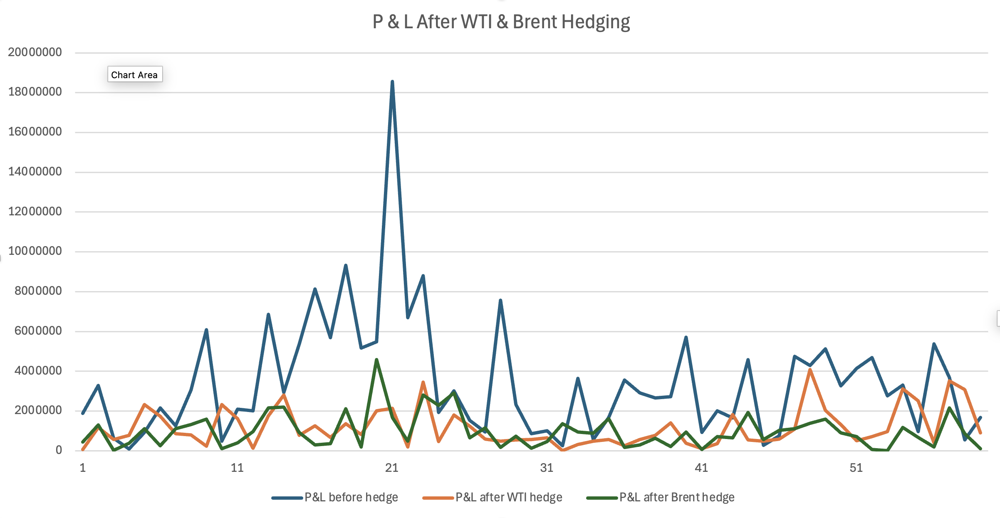
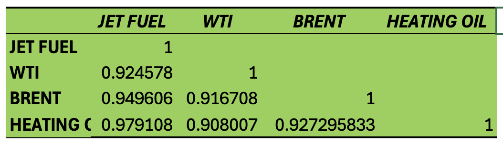

---

# **✈️ JetBlue Fuel Hedging Strategy Analysis (2007–2011)**


---

# **📌 Table of Contents**

* [Project Overview](#project-overview)
* [Business Problem](#business-problem)
* [Dataset](#dataset)
* [Tools & Skills Used](#tools--skills-used)
* [Methodology](#methodology)
* [Key Findings](#key-findings)
* [Visualisations](#visualisations)
* [Hedging Strategy Recommendation](#hedging-strategy-recommendation)
* [Risks Not Eliminated by Hedging](#risks-not-eliminated-by-hedging)
* [Repository Structure](#repository-structure)
* [Future Improvements](#future-improvements)
* [Author](#author)

---

# **📊 Project Overview**

This project analyses **JetBlue Airways’ fuel hedging strategy** using historical commodity price data from **2007–2011**. 
Fuel costs are one of the **largest operating expenses in the airline industry**, and volatility in oil prices can significantly impact airline profitability.

The goal of this analysis is to determine:

* Whether **JetBlue should hedge its fuel costs**
* Which commodity provides the **best hedge proxy for jet fuel**
* Whether hedging **reduces fuel cost volatility**

The analysis evaluates three possible hedging benchmarks:

* **WTI crude oil**
* **Brent crude oil**
* **Heating oil**

Using **statistical analysis and hedging simulations**, this project measures how effectively each commodity tracks jet fuel prices and how well hedging reduces financial risk.

---

# **💼 Business Problem**

Airlines face significant exposure to **jet fuel price fluctuations**.

Between the **1990s and early 2000s**, jet fuel prices increased dramatically from approximately **$0.50 per gallon to nearly $4 per gallon**, creating major cost pressures for airlines. 

At the same time:

* Fuel represented **~40% of JetBlue’s operating expenses in 2011**. 
* JetBlue’s fuel consumption increased as the airline expanded its operations.
* Airlines often **cannot fully pass rising fuel costs to customers**.

To manage this risk, airlines use **fuel hedging strategies**, which involve financial derivatives designed to stabilize fuel costs.

However, hedging introduces its own risks, such as:

* Basis risk
* Transaction costs
* Potential losses if fuel prices decline

This project evaluates whether JetBlue’s hedging strategy effectively reduces risk.

---

# **🗂 Dataset**

The dataset contains **monthly commodity price data from 2007–2011**.

### Variables included:

| Variable    | Description                                              |
| ----------- | -------------------------------------------------------- |
| Jet Fuel    | U.S. Gulf Coast Jet Fuel Spot Price (USD per gallon)     |
| WTI         | West Texas Intermediate crude oil price (USD per barrel) |
| Brent       | Brent crude oil price (USD per barrel)                   |
| Heating Oil | NY Harbor Heating Oil price (USD per gallon)             |

### Data transformations performed

* Converted crude oil prices from **per barrel to per gallon**
* Calculated **monthly price changes**
* Generated **correlation matrices**
* Performed **regression analysis**

---

# **🛠 Tools & Skills Used**

### Tools

* Microsoft Excel
* Statistical analysis
* Financial modelling

### Techniques

* Data cleaning
* Commodity price analysis
* Correlation analysis
* Linear regression
* Hedging simulation
* Financial risk analysis
* Descriptive statistics
* Data visualisation

---

# **🔬 Methodology**

The analysis was performed in five stages.

---

## **1. Data Preparation**

* Imported monthly commodity price data
* Converted crude oil prices to **per gallon** units
* Calculated **monthly price changes**

---

## **2. Correlation Analysis**

Measured how closely each commodity moves with jet fuel prices.

This helps determine which commodity is the **best proxy for jet fuel prices**.

---

## **3. Regression Analysis**

Regression models were used to measure:

* Strength of relationships between commodities and jet fuel
* Explanatory power of each hedge proxy

---

## **4. Hedging Simulation**

A **back-test simulation** was conducted to evaluate hedging effectiveness.

Assumptions:

* JetBlue hedges **20 million gallons per month**
* Equivalent to **240 million gallons annually**
* Approximately **45.7% of annual consumption**

Three scenarios were simulated:

1️⃣ No hedge
2️⃣ WTI hedge
3️⃣ Brent hedge

---

## **5. Risk Analysis**

The project also evaluates risks that **remain even after hedging**, including:

* Basis risk
* Volume risk
* Operational risk
* Counterparty risk

---

# **📈 Key Findings**

## **1️⃣ Heating Oil Tracks Jet Fuel Most Closely**

Correlation results show:

| Commodity   | Correlation with Jet Fuel |
| ----------- | ------------------------- |
| Heating Oil | **0.979**                 |
| Brent       | 0.949                     |
| WTI         | 0.924                     |

Heating oil therefore provides the **closest natural hedge for jet fuel prices**.

---

## **2️⃣ Regression Analysis Confirms Results**

Regression results show:

| Commodity   | R²       | Interpretation         |
| ----------- | -------- | ---------------------- |
| Heating Oil | **0.96** | Strongest relationship |
| Brent       | 0.90     | Strong relationship    |
| WTI         | 0.85     | Weakest relationship   |

Heating oil explains **~96% of jet fuel price movements**.

---

## **3️⃣ Hedging Reduces Fuel Cost Volatility**

Simulation results show that hedging significantly stabilizes fuel costs.

| Scenario    | Mean Monthly P&L | Standard Deviation |
| ----------- | ---------------- | ------------------ |
| No Hedge    | $3.47M           | $3.04M             |
| WTI Hedge   | $1.17M           | $0.97M             |
| Brent Hedge | **$0.99M**       | **$0.87M**         |

Brent hedging produces the **most stable results**.

---

## **4️⃣ WTI Became Less Effective After 2010**

WTI prices diverged from global oil markets during this period, creating **basis risk**.

Brent prices tracked jet fuel more closely because Brent is more aligned with **global oil market dynamics**.

---

# **📊 Visualisations**

## **P&L Comparison**



---

## **Commodity Price Correlations**



---

## **Regression Results**


---

# **📉 Hedging Strategy Recommendation**

Based on the analysis:

JetBlue should **not rely solely on WTI crude oil** for hedging.

Instead, the airline should adopt a **diversified hedging strategy**:

* Increase use of **Brent crude oil**
* Include **refined products such as heating oil**
* Maintain **limited WTI exposure**

This hybrid strategy would:

* Reduce **basis risk**
* Maintain **market liquidity**
* Improve overall hedge effectiveness

---

# **⚠️ Risks Not Eliminated by Hedging**

Even with hedging, several risks remain:

| Risk Type         | Description                                          |
| ----------------- | ---------------------------------------------------- |
| Volume Risk       | Actual fuel consumption may differ from forecast     |
| Basis Risk        | Hedging instrument may not perfectly track jet fuel  |
| Operational Risk  | Changes in routes or flight schedules                |
| Counterparty Risk | OTC derivatives expose airlines to bank default risk |

Hedging therefore **reduces but does not eliminate risk**.

---

# **📂 Repository Structure**

```
JetBlue-Fuel-Hedging-Analysis
│
├── data
│   └── Case Study.xlsx
│
├── analysis
│   └── hedging_calculations.xlsx
│
├── images
│   ├── pnl_comparison.png
│   ├── correlation_matrix.png
│   └── price_trends.png
│
├── README.md
└── report
    └── JetBlue Case Study.pdf
```

---

# **🚀 Future Improvements**

Potential extensions include:

* Implementing the analysis in **Python (Pandas / NumPy)**
* Performing **portfolio hedge optimisation**
* Testing **options-based hedging strategies**
* Extending the dataset beyond **2011**
* Building an **interactive dashboard (Power BI / Tableau)**

---

# **👩‍💻 Author**

**Rachel Tran**

Finance & Data Analytics Student

Interests:

* Financial derivatives
* Commodity markets
* Risk management
* Data analytics in finance

---
